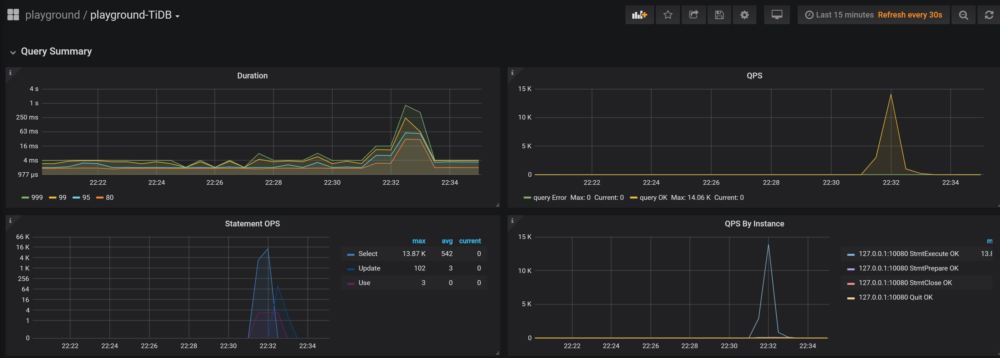
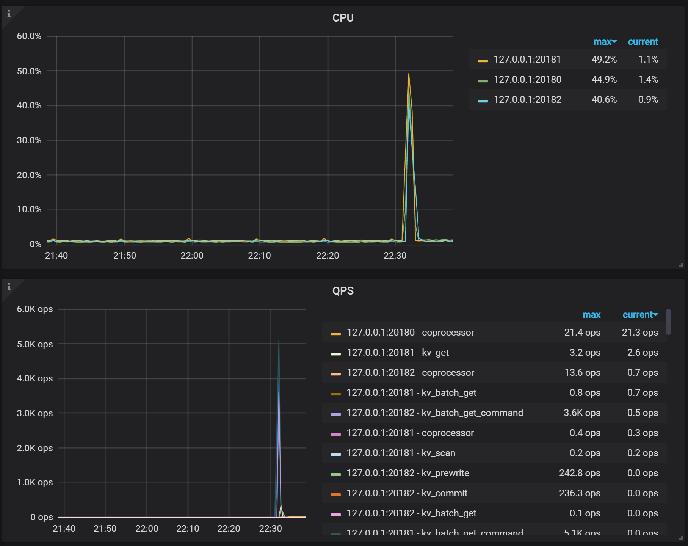
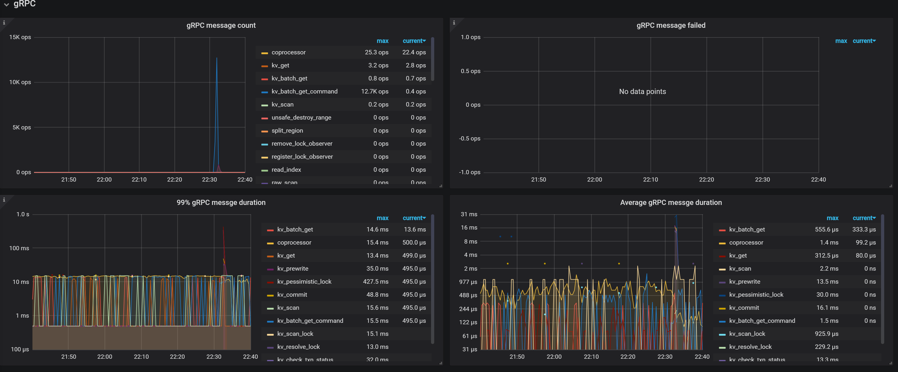

## 环境
windows10 wsl ubuntu 18.04
CPU: AMD Ryzen 7 3700X 8-Core
Memory: 16G
Disk: KIOXIA NVMe 512G

## TIDB 环境
使用了最简单的单机配置，1db + 1pd + 3kv
```bash
tiup playground v4.0.0 --db 1 --pd 1 --kv 3 --monitor
```
因为只有一块硬盘，所以下面的评测都只测试了小数据量的评测

## sysbench

### 准备数据
```bash
mysql -h 127.0.0.1 -P 4000 -u root --execute="create database sbtest;"
# mysql -h 127.0.0.1 -P 4000 -u root --execute=" set global tidb_txn_mode='pessimistic';"

```
### 测试
运行脚本
```bash
sysbench --config-file=config oltp_update_non_index --threads=32 --tables=32 --table_size=10000 prepare
sysbench --config-file=config oltp_point_select --tables=32 --table-size=10000 --threads=128 run
sysbench --config-file=config oltp_update_index --tables=32 --table-size=10000 --threads=128 run
```

config
```bash
mysql-host=127.0.0.1
mysql-port=4000
mysql-user=root
mysql-db=sbtest
report-interval=10
db-driver=mysql
```


运行日志
```
zhangchuan@DESKTOP-70Q26MR:~/workspace/tiup-playground/sysbench$ sysbench --config-file=config oltp_point_select --tables=32 --table-size=10000 --threads=128 run
sysbench 1.0.11 (using system LuaJIT 2.1.0-beta3)

Running the test with following options:
Number of threads: 128
Report intermediate results every 10 second(s)
Initializing random number generator from current time


Initializing worker threads...

Threads started!

[ 10s ] thds: 128 tps: 62328.10 qps: 62328.10 (r/w/o: 62328.10/0.00/0.00) lat (ms,95%): 5.57 err/s: 0.00 reconn/s: 0.00
SQL statistics:
    queries performed:
        read:                            624166
        write:                           0
        other:                           0
        total:                           624166
    transactions:                        624166 (62334.75 per sec.)
    queries:                             624166 (62334.75 per sec.)
    ignored errors:                      0      (0.00 per sec.)
    reconnects:                          0      (0.00 per sec.)

General statistics:
    total time:                          10.0125s
    total number of events:              624166

Latency (ms):
         min:                                  0.17
         avg:                                  2.05
         max:                                 28.27
         95th percentile:                      5.57
         sum:                            1279302.87

Threads fairness:
    events (avg/stddev):           4876.2969/53.84
    execution time (avg/stddev):   9.9946/0.00

zhangchuan@DESKTOP-70Q26MR:~/workspace/tiup-playground/sysbench$ sysbench --config-file=config oltp_update_index --tables=32 --table-size=10000 --threads=128 run
sysbench 1.0.11 (using system LuaJIT 2.1.0-beta3)

Running the test with following options:
Number of threads: 128
Report intermediate results every 10 second(s)
Initializing random number generator from current time


Initializing worker threads...

Threads started!

[ 10s ] thds: 128 tps: 3717.48 qps: 3717.48 (r/w/o: 0.00/3717.48/0.00) lat (ms,95%): 39.65 err/s: 0.00 reconn/s: 0.00
SQL statistics:
    queries performed:
        read:                            0
        write:                           37311
        other:                           0
        total:                           37311
    transactions:                        37311  (3664.51 per sec.)
    queries:                             37311  (3664.51 per sec.)
    ignored errors:                      0      (0.00 per sec.)
    reconnects:                          0      (0.00 per sec.)

General statistics:
    total time:                          10.1811s
    total number of events:              37311

Latency (ms):
         min:                                 12.14
         avg:                                 34.35
         max:                               1348.16
         95th percentile:                     39.65
         sum:                            1281628.24

Threads fairness:
    events (avg/stddev):           291.4922/11.17
    execution time (avg/stddev):   10.0127/0.03
```


### 监控截图




## go-ycsb

### 测试
运行脚本
```bash
./bin/go-ycsb load mysql -P workloads/workloada -p recordcount=1000 -p mysql.host=127.0.0.1 -p mysql.port=4000 --threads 16
./bin/go-ycsb run mysql -P workloads/workloada -p recordcount=1000 -p mysql.host=127.0.0.1 -p mysql.port=4000 --threads 16
```

运行日志
```
zhangchuan@DESKTOP-70Q26MR:~/workspace/go-ycsb$ ./bin/go-ycsb load mysql -P workloads/workloada -p recordcount=1000 -p mysql.host=127.0.0.1 -p mysql.port=4000 --threads 16
***************** properties *****************
"mysql.port"="4000"
"dotransactions"="false"
"readallfields"="true"
"insertproportion"="0"
"workload"="core"
"threadcount"="16"
"readproportion"="0.5"
"scanproportion"="0"
"recordcount"="1000"
"updateproportion"="0.5"
"requestdistribution"="uniform"
"operationcount"="1000"
"mysql.host"="127.0.0.1"
**********************************************
Run finished, takes 7.2351333s
INSERT - Takes(s): 7.2, Count: 992, OPS: 137.5, Avg(us): 8048, Min(us): 5273, Max(us): 22313, 99th(us): 21000, 99.9th(us): 23000, 99.99th(us): 23000
zhangchuan@DESKTOP-70Q26MR:~/workspace/go-ycsb$ ./bin/go-ycsb run mysql -P workloads/workloada -p recordcount=1000 -p mysql.host=127.0.0.1 -p mysql.port=4000 --threads 16
***************** properties *****************
"scanproportion"="0"
"mysql.port"="4000"
"operationcount"="1000"
"dotransactions"="true"
"workload"="core"
"mysql.host"="127.0.0.1"
"updateproportion"="0.5"
"insertproportion"="0"
"threadcount"="16"
"recordcount"="1000"
"readproportion"="0.5"
"requestdistribution"="uniform"
"readallfields"="true"
**********************************************
Run finished, takes 467.4088ms
READ   - Takes(s): 0.5, Count: 484, OPS: 1045.0, Avg(us): 1203, Min(us): 681, Max(us): 3771, 99th(us): 4000, 99.9th(us): 4000, 99.99th(us): 4000
UPDATE - Takes(s): 0.5, Count: 506, OPS: 1110.1, Avg(us): 9021, Min(us): 620, Max(us): 186199, 99th(us): 14000, 99.9th(us): 187000, 99.99th(us): 187000
```

### 监控截图


## go-tpc
### 准备数据
```bash
mysql -h 127.0.0.1 -P 4000 -u root --execute="create database sbtest;"
# mysql -h 127.0.0.1 -P 4000 -u root --execute=" set global tidb_txn_mode='pessimistic';"

```
### 测试
运行脚本
tpcc
```bash
./bin/go-tpc tpcc -H 127.0.0.1 -P 4000 -D tpcc --warehouses 10 prepare
./bin/go-tpc tpcc -H 127.0.0.1 -P 4000 -D tpcc --warehouses 10 run
```

tpch
```bash
./bin/go-tpc tpch prepare -H 127.0.0.1 -P 4000 -D tpch --sf 50 --analyze
./bin/go-tpc tpch run -H 127.0.0.1 -P 4000 -D tpch --sf 50
```

### 问题
windows wsl2 使用Virtual Hardware Disk (VHD)技术来逐步扩展用于linux的磁盘，所以对io类型访问呢有一些影响。